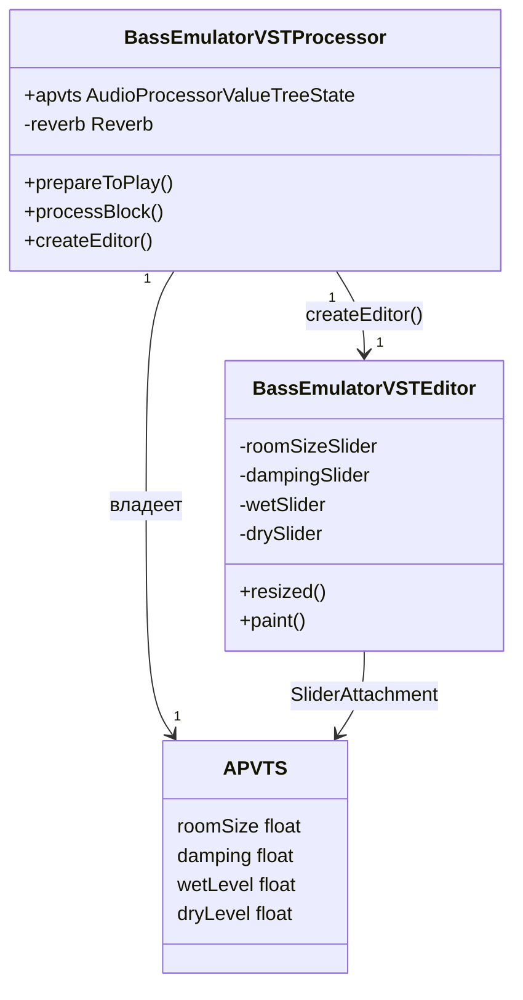
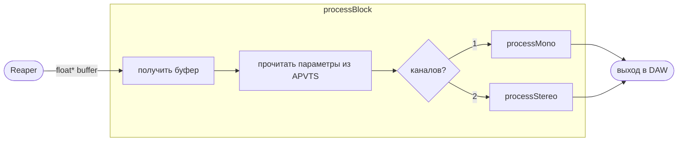
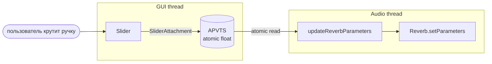
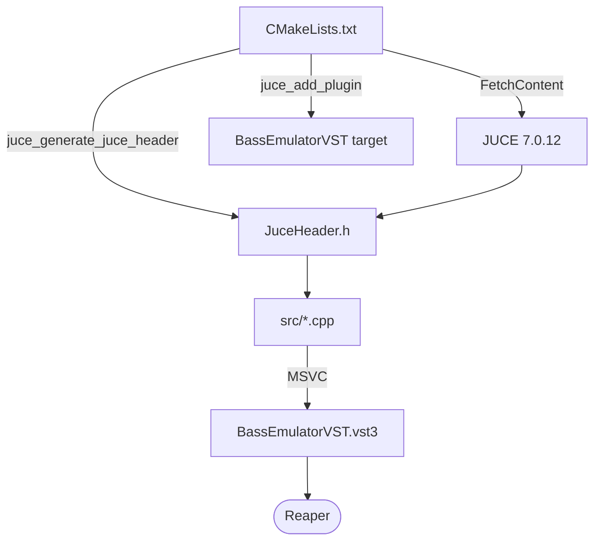

# BassEmulatorVST

VST plugin для Windows/Reaper: трансформация гитарного звука в звук баса.
Цель — решить проблему неточного интонирования при атаке (характерно для Guitar Rig, Ampero Stomp).

## Архитектурные заметки

### RTNeural
https://github.com/jatinchowdhury18/RTNeural

Специализированная C++ библиотека для real-time инференса нейросетей в аудио-плагинах.
Используется в amp-sim плагинах (BYOD, GuitarML и др.).

**Почему актуально для этого проекта:**
- Поддерживает LSTM, GRU, Conv1D — подходящие архитектуры для end-to-end guitar→bass
- Спроектирована под минимальную латентность (real-time audio thread safe)
- Хорошо интегрируется с JUCE

**Планируемые режимы:**
- Real-time: лёгкая модель для мониторинга во время записи
- Offline: тяжёлая модель для пост-обработки аудиофайла

## Архитектура кода

### Структура файлов

```
BassEmulatorVST/
├── CMakeLists.txt          ← инструкция для сборки
└── src/
    ├── PluginProcessor     ← МОЗГ: вся логика обработки звука
    └── PluginEditor        ← ЛИЦО: GUI с ручками
```

### Классы



### Поток аудиосигнала



### Поток параметров GUI → DSP



> **Почему atomic?** GUI и аудио работают в разных потоках. `atomic<float>` — thread-safe передача значения без блокировок, что критично для real-time аудио.

### Сборка проекта



## Roadmap

- [ ] MVP: JUCE plugin wrapper + простой реверб
- [ ] Исследование архитектуры end-to-end модели (guitar→bass)
- [ ] Интеграция RTNeural
- [ ] Real-time режим
- [ ] Offline режим