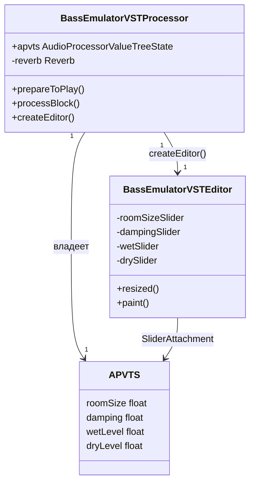
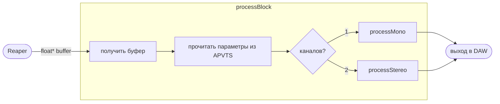
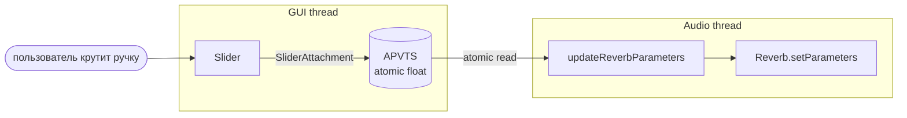
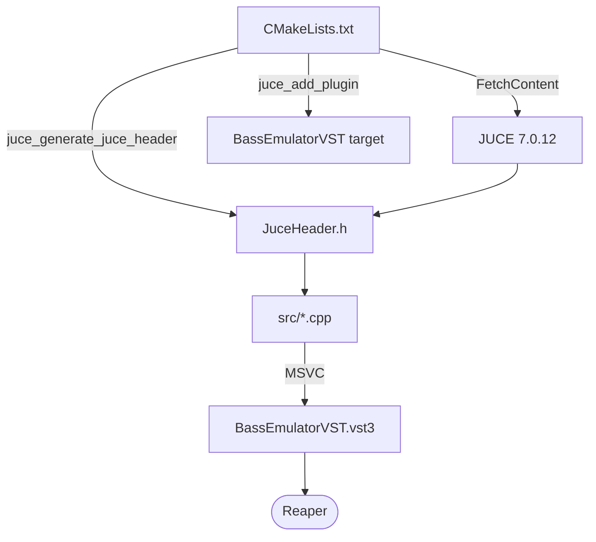

# BassEmulatorVST

VST3-плагин на JUCE для преобразования монофонической гитары в бас в Reaper. Текущий детектор высоты тона использует потоковую модель PESTO через ANIRA/ONNX Runtime.

Перед использованием прочитай [гайд по эксплуатации](docs/OPERATIONS.md): проект Reaper и аудиоустройство должны работать на 44,1 кГц. Актуальная структура исходников и команды разработки описаны в [AGENTS.md](AGENTS.md).
Команды offline fine-tune, генерации teacher-меток, дистилляции и экспорта — в
[README ML-пайплайна](ml/pesto/finetune/README.md).

## Сборка с одной из трёх PESTO-моделей

Для слухового сравнения подготовлены три потоковых ONNX-экспорта:

| Вариант | ONNX в репозитории |
|---|---|
| `upstream_ce → KL` | `models/eval_upstream_ce_best_e084_pitch/pesto.onnx` |
| `upstream_ce → KL+SSL` | `models/eval_upstream_ce_best_e084_pitch_kl_ssl_upstreamce/pesto.onnx` |
| Старый `MIR → KL+SSL`, вес equivariance 1.0 | `models/eval_pitch_kl_ssl_equiv1_20260928_best/pesto.onnx` |

Рядом с каждым ONNX лежит `pesto_onnx_meta.json` с checkpoint и параметрами
экспорта. Все три модели рассчитаны на 44,1 кГц, chunk 441 сэмпл, cache 3876,
`mirror=1.0/refill`; confidence-ветка во всех трёх оставлена от `mir-1k_g7`. Для
сборки плагина Python, обучающие WAV и checkpoints из `runs/` не нужны.

Плагин пока **не переключает модели во время работы**: CMake встраивает ровно
один ONNX в каждый VST3. `models/pesto.onnx` сейчас отсутствует, поэтому путь
нужно указать при конфигурации. Например, в PowerShell из корня репозитория:

```powershell
$model = (Resolve-Path 'models/eval_upstream_ce_best_e084_pitch/pesto.onnx').Path
cmake -S . -B build/upstream-kl -DCMAKE_BUILD_TYPE=Release "-DPESTO_ONNX_PATH=$model"
cmake --build build/upstream-kl --config Release
```

Для остальных вариантов подставь путь из таблицы и **другой** build-каталог,
например `build/upstream-kl-ssl` или `build/old-kl-ssl-equiv1`. На Windows
результат обычно находится в
`build/<вариант>/BassEmulatorVST_artefacts/Release/VST3/BassEmulatorVST.vst3`.
У этих сборок пока одинаковые имя и VST3-ID: храни готовые бандлы отдельно,
а в Reaper проверяй по одному, закрывая его перед заменой установленного плагина.
Требования к сборке описаны в [AGENTS.md](AGENTS.md#сборка-плагина).

## Исторические архитектурные заметки

Схемы ниже относятся к раннему прототипу с ревербератором. Текущий тракт PESTO и команды разработки описаны в [AGENTS.md](AGENTS.md).

### RTNeural
https://github.com/jatinchowdhury18/RTNeural

Специализированная C++ библиотека для real-time инференса нейросетей в аудио-плагинах.
Используется в amp-sim плагинах (BYOD, GuitarML и др.).

**Почему актуально для этого проекта:**
- Поддерживает LSTM, GRU, Conv1D — подходящие архитектуры для end-to-end guitar→bass
- Спроектирована под минимальную латентность (real-time audio thread safe)
- Хорошо интегрируется с JUCE

**Планируемые режимы:**
- Real-time: лёгкая модель для мониторинга во время записи
- Offline: тяжёлая модель для пост-обработки аудиофайла

## Архитектура кода

### Структура файлов

```
BassEmulatorVST/
├── CMakeLists.txt          ← инструкция для сборки
└── src/
    ├── PluginProcessor     ← МОЗГ: вся логика обработки звука
    └── PluginEditor        ← ЛИЦО: GUI с ручками
```

### Классы


```mermaid
classDiagram
    class BassEmulatorVSTProcessor {
        +apvts AudioProcessorValueTreeState
        -reverb Reverb
        +prepareToPlay()
        +processBlock()
        +createEditor()
    }
    class BassEmulatorVSTEditor {
        -roomSizeSlider
        -dampingSlider
        -wetSlider
        -drySlider
        +resized()
        +paint()
    }
    class APVTS {
        roomSize float
        damping float
        wetLevel float
        dryLevel float
    }
    BassEmulatorVSTProcessor "1" --> "1" BassEmulatorVSTEditor : createEditor()
    BassEmulatorVSTProcessor "1" --> "1" APVTS : владеет
    BassEmulatorVSTEditor --> APVTS : SliderAttachment
```

### Поток аудиосигнала


```mermaid
flowchart LR
    DAW([Reaper]) -->|float* buffer| PB

    subgraph processBlock
        PB[получить буфер] --> URP[прочитать параметры из APVTS]
        URP --> CH{каналов?}
        CH -->|1| MONO[processMono]
        CH -->|2| STEREO[processStereo]
    end

    MONO --> OUT([выход в DAW])
    STEREO --> OUT
```

### Поток параметров GUI → DSP


```mermaid
flowchart LR
    USER([пользователь крутит ручку]) --> SL[Slider]

    subgraph "GUI thread"
        SL -->|SliderAttachment| APVTS[(APVTS\natomic float)]
    end

    subgraph "Audio thread"
        APVTS -->|atomic read| URP[updateReverbParameters]
        URP --> REV[Reverb.setParameters]
    end
```

> **Почему atomic?** GUI и аудио работают в разных потоках. `atomic<float>` — thread-safe передача значения без блокировок, что критично для real-time аудио.

### Сборка проекта


```mermaid
flowchart TD
    CML[CMakeLists.txt] -->|FetchContent| JUCE[JUCE 7.0.12]
    CML -->|juce_add_plugin| TGT[BassEmulatorVST target]
    CML -->|juce_generate_juce_header| HDR[JuceHeader.h]
    JUCE --> HDR
    HDR --> SRC[src/*.cpp]
    SRC -->|MSVC| VST3[BassEmulatorVST.vst3]
    VST3 --> REAPER([Reaper])
```

## Roadmap

- [x] MVP: JUCE plugin wrapper + простой реверб
- [ ] Исследование архитектуры end-to-end модели (guitar→bass)
- [ ] Интеграция RTNeural
- [ ] Real-time режим
- [ ] Offline режим
